# Routes — Coach B Under the Tree

Fill in this file with your team's route tree. I'll use it to update the site content and quizzes.

Receivers need to know these cold. See also `positions.md` (who runs them) and `formations.md` (where they line up).

---

## Learning path

We teach in this order:

1. **Routes** — Wide receivers learn the routes they will run ← **this file**
2. **Formations** — Where everyone lines up (Spread, Trips Left, Trips Right)
3. **Plays** — Route combinations called from each formation (coming later)

---

## Route tree

| Route Number | Route Name | Depth (short / medium / deep) |
| ------------ | ---------- | ----------------------------- |
| 1            | Hitch      | short                         |
| 2            | Slant      | short                         |
| 3            | Arrow      | short                         |
| 4            | In         | medium                        |
| 5            | Out        | medium                        |
| 6            | Curl       | medium                        |
| 7            | Wheel      | deep                          |
| 8            | Post       | deep                          |
| 9            | Corner     | deep                          |
| 10           | Vertical   | deep                          |

Whiteboard overview:

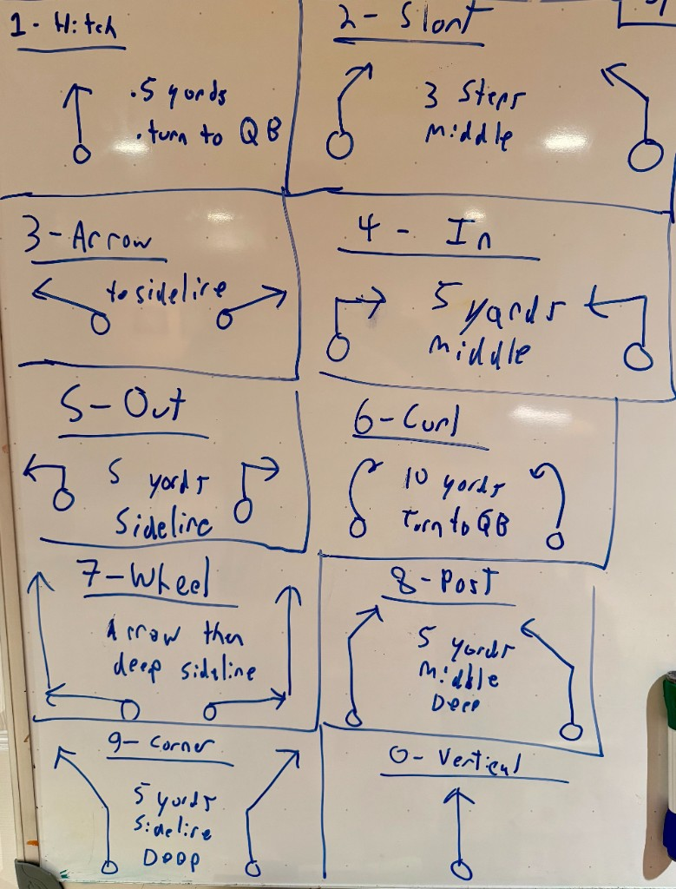

---

### 1 — Hitch

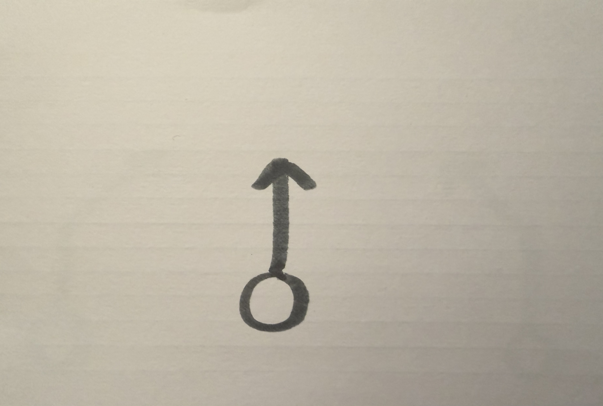

**Depth:** short

**Details:**

### 2 — Slant

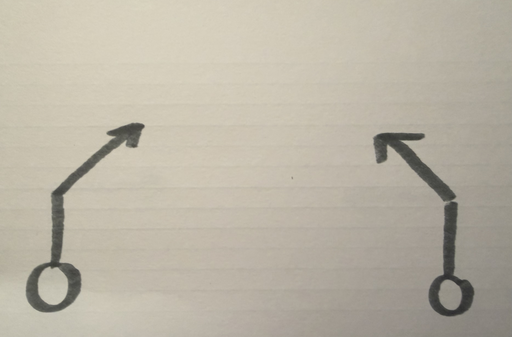

**Depth:** short

**Details:**

### 3 — Arrow

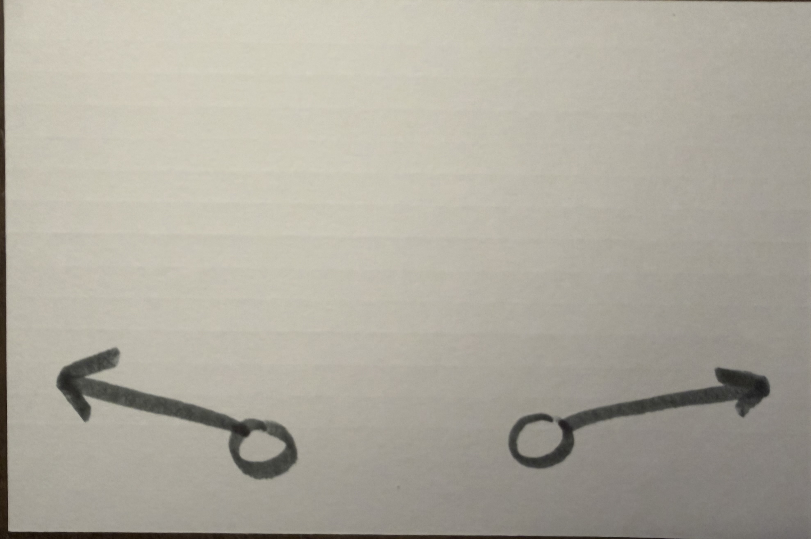

**Depth:** short

**Details:**

### 4 — In

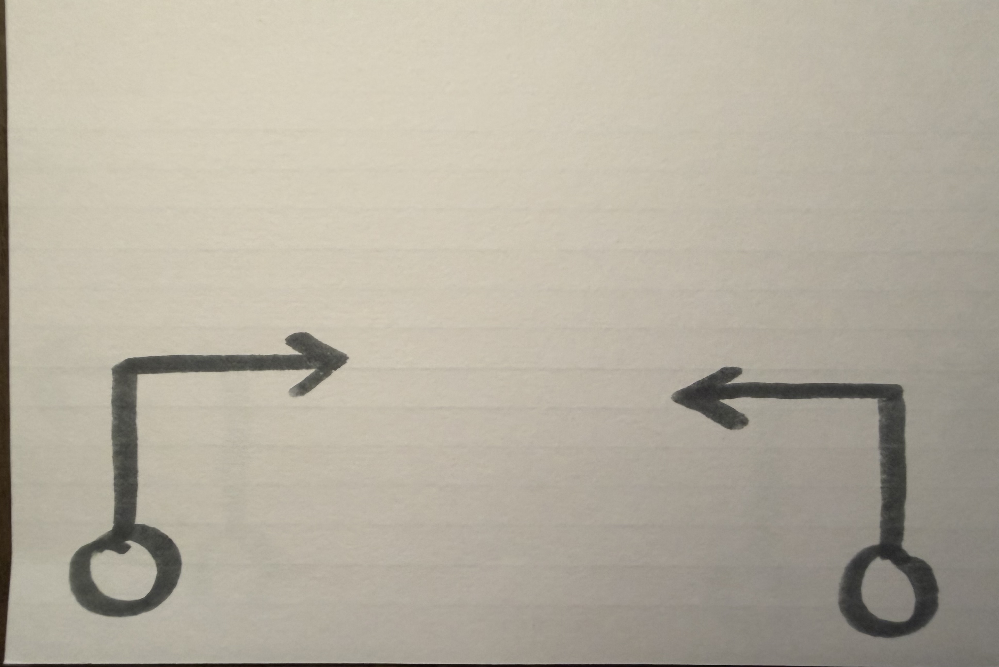

**Depth:** medium

**Details:**

### 5 — Out

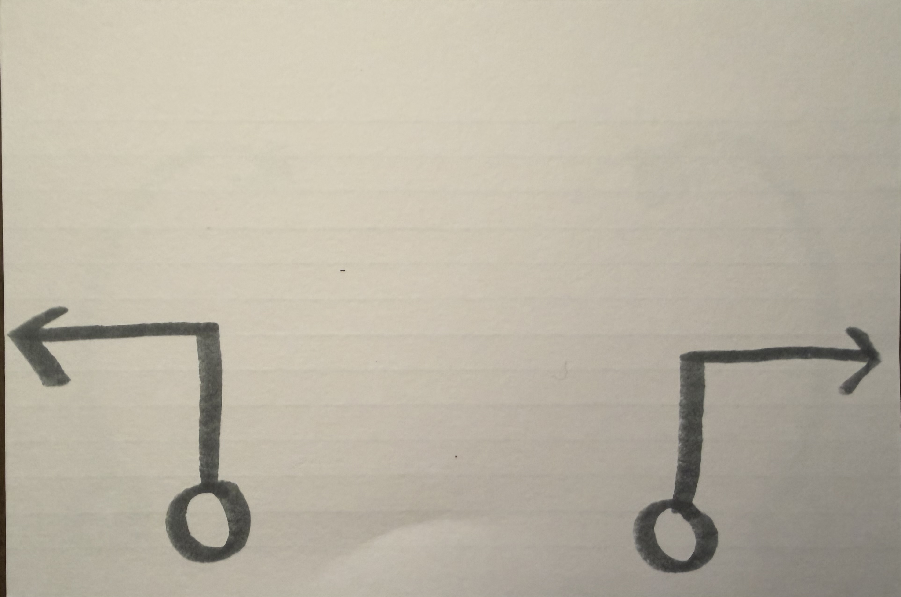

**Depth:** medium

**Details:**

### 6 — Curl

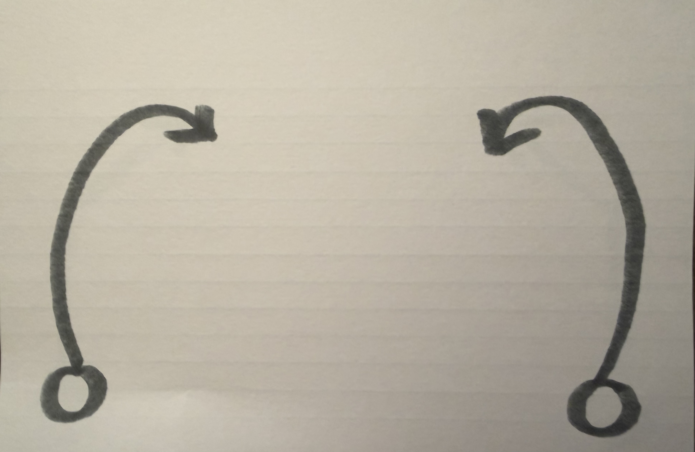

**Depth:** medium

**Details:**

### 7 — Wheel

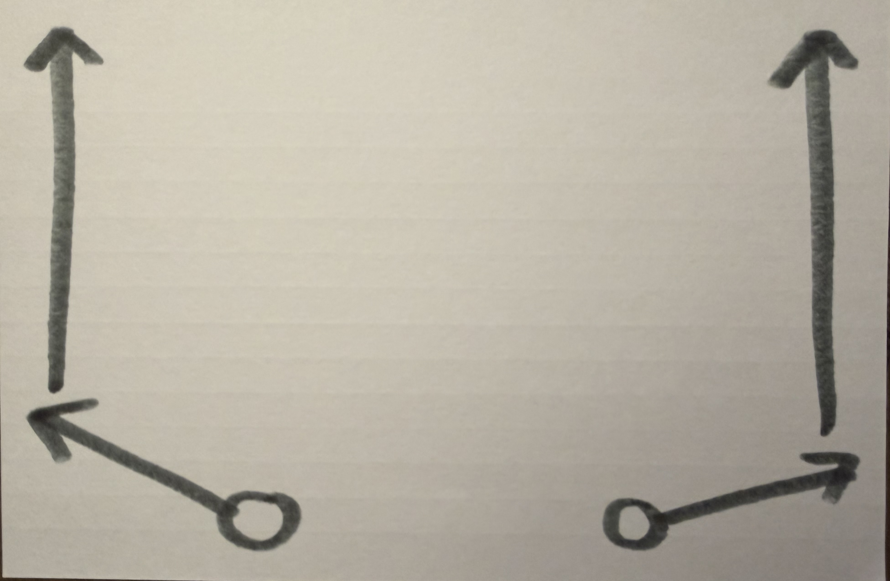

**Depth:** deep

**Details:**

### 8 — Post

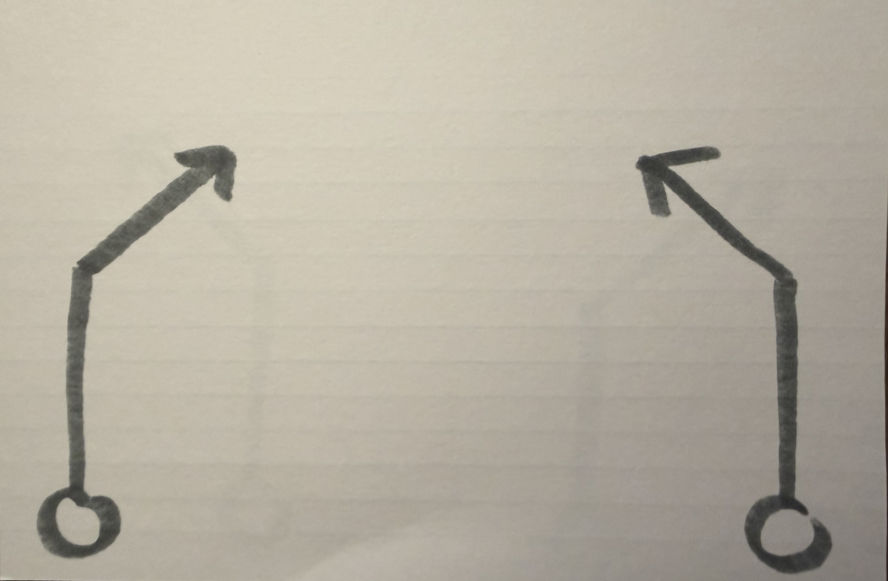

**Depth:** deep

**Details:**

### 9 — Corner

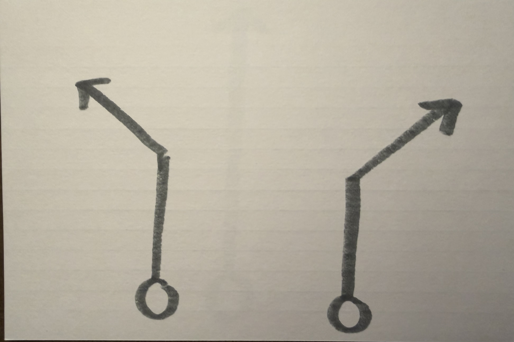

**Depth:** deep

**Details:**

### 10 — Vertical

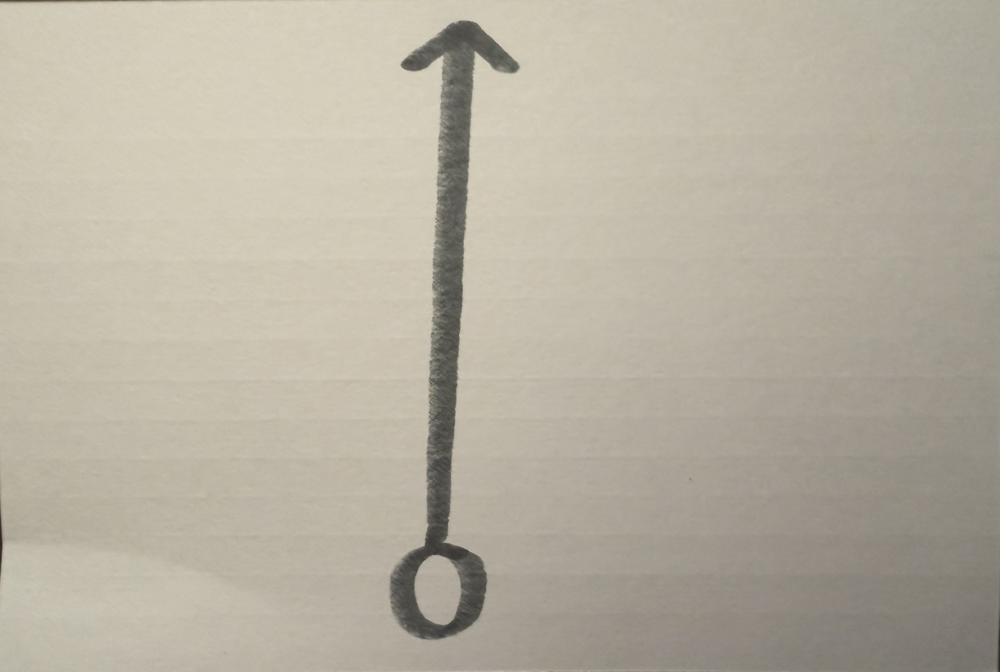

**Depth:** deep

**Details:**

